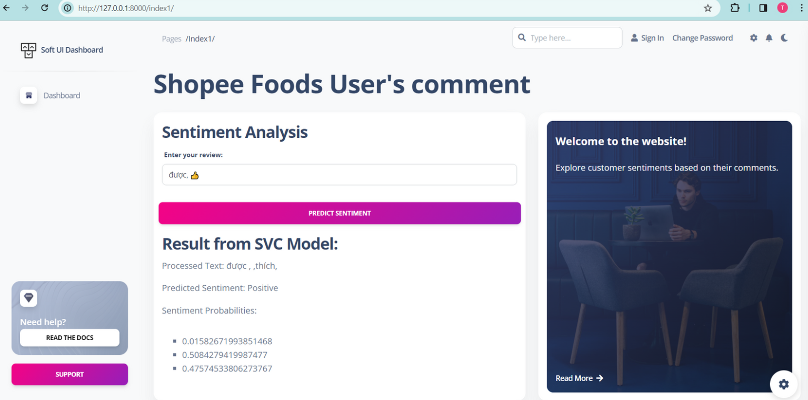

## Shopee Food Sentiment Predicts
 

## Manual Build 

> 👉 Download the code  

```bash
$ git clone https://github.com/app-generator/django-soft-ui-dashboard.git
$ cd django-soft-ui-dashboard
```

<br />

> 👉 Install modules via `VENV`  

```bash
$ virtualenv env
$ source env/bin/activate
$ pip install -r requirements.txt
```

<br />

> 👉 Set Up Database

```bash
$ python manage.py makemigrations
$ python manage.py migrate
```

<br />

> 👉 Create the Superuser

```bash
$ python manage.py createsuperuser
```

<br />

> 👉 Start the app

```bash
$ python manage.py runserver
```

At this point, the app runs at `http://127.0.0.1:8000/`. 

<br />

## Codebase structure

The project is coded using a simple and intuitive structure presented below:

```bash
< PROJECT ROOT >
   |
   |-- core/                            
   |    |-- settings.py   # Project Configuration  
   |    |-- urls.py       # Project Routing
   |
   |-- home/
   |    |-- models/        #saved model 
   |    |-- forms.py      # form to input the cmt
   |    |-- sentiment_predictor.py #the pretrain data => predict
   |    |-- views.py      # APP Views 
   |    |-- urls.py       # APP Routing
   |    |-- models.py     # APP Models 
   |    |-- tests.py      # Tests  
   |     
   |-- templates/
   |    |-- includes/     # UI components 
   |    |-- layouts/      # Masterpages
   |    |-- pages/        # Kit pages 
   |
   |-- static/   
   |    |-- css/                                   # CSS Files 
   |    |-- scss/                                  # SCSS Files 
   |         |-- soft-ui-dashboard/_variables.scss # File Used for Theme Styling
   |
   |-- requirements.txt   # Project Dependencies
   |
   |-- env.sample         # ENV Configuration (default values)
   |-- manage.py          # Start the app - Django default start script
   |
   |-- ************************************************************************
```

<br />

